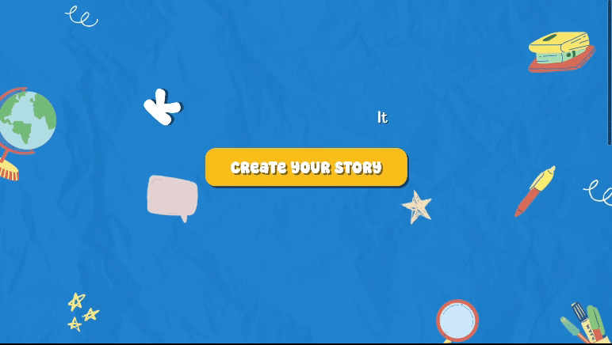

<h1>Build-A-Book</h1>

  Build-A-Book is an <b>educational platform</b>, putting the creative process in the hands of parents. Starting with a <b>brief prompt</b>, our web application can craft a <b>personalized and immersive story for children</b>. Build-A-Book 
  blends education and creativity; <b>transforming learning</b> into a comprehensive experience for both parents and children.

<h3>Our Team</h3>
<ul>
  <li>
    <a href = "https://www.linkedin.com/in/thanh-huy-nguyen-703606220/" title = "Back-End">Thanh-Huy Nguyen</a>
  </li>
  <li>
    <a href = "https://www.linkedin.com/in/hugo-vaillant-852568269/" title = "Front-End & UI">Hugo Vaillant</a>
  </li>
  <li>
    <a href = "https://www.linkedin.com/in/anne-marie-nguyen-174b15243/" title = "Website Design">Anne-Marie Nguyen</a>
  </li>
  <li>
    <a href = "https://www.linkedin.com/in/jasonrustom/" title = "Front-End & UI">Jason Rustom</a>
  </li>
</ul>

<h3>Why We Built It</h3>

  This project was built in <b>24 hours</b> for the <b>ConUHacks VIII</b> Hackathon based in Montreal, Canada. Inspired by the profound impact of <b>heartfelt moments</b> shared with parents during childhood, our team sought the desire to converge education and technology in order to make these moments more <b>accessible</b>, <b>interactive</b> and <b>sustainable</b>. 
<h3>How We Built it</h3>

  With the help of the innovative capabilities of <b>Stability AI</b> and <b>Open AI</b>, our team was able to generate personalized, multi-sentence stories from a basic prompt, forming the core of Build-A-Book's unique offering. For the generation of stories, <b>python</b> and <b>flask</b> were used to work with Stability and Open AI api's, seamlessly converting the user's simple prompt into an entire children's book. The integration of these images, along with the entire user-interface was achieved using <b>React</b>, along with <b>HTML</b> and <b>CSS</b>. Thanks to our <b>exceptional UI design</b> and <b>creative use of AI</b>, Build-A-Book was <b>awarded</b> with the <a href = "https://devpost.com/software/build-a-book">Best Use of AI in Education</a> at ConUHacks VIII!

<h3>Our Tech Stack</h3>

  
  
  
  
  

<h3>Build-A-Book's Future</h3>

  Looking forward, our team envisions further customization features that grant the user greater control over the creative aspects of the tales. The primary focus remains on continuous refinement and improvement of the platform to enhance educational and creative experiences for families, ensuring tailored interactions for all users.
  <i>We are currently working on hosting this project and making it available for public use!</i>

<!-- Written by Jason Rustom :) -->